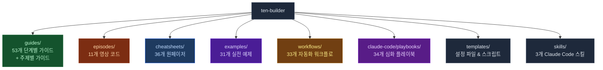
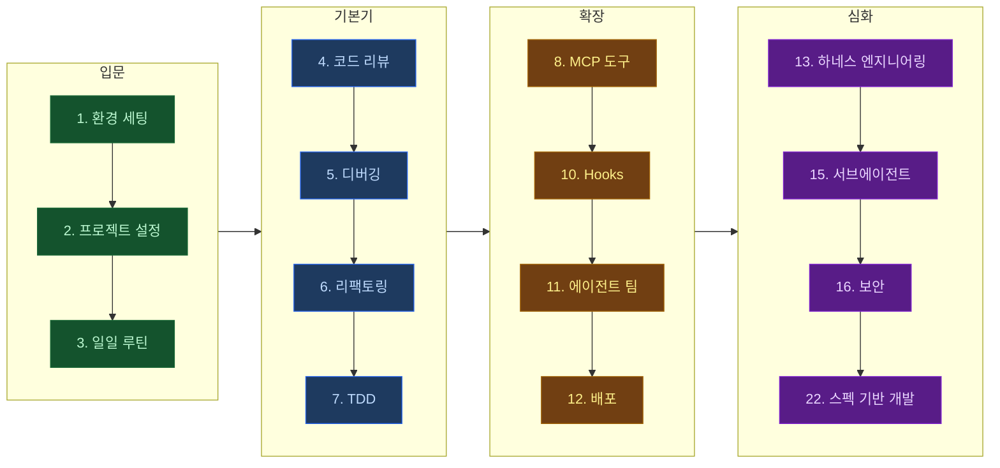

# 텐빌더

> AI로 10배 빠르게 빌드하는 방법을 알려드려요

[](https://maily.so/tenbuilder)
[](https://youtube.com/@ten-builder)

---

실무에서 바로 쓸 수 있는 AI 활용법을 다루고 있어요.

글로벌 IT 회사에서 6년간 2억+ 유저 서비스를 담당했던 엔지니어가,
Claude Code, Gemini 등 AI를 실무에서 직접 써보고 검증한 내용을 공유합니다.

- **직접 써보고 검증한 AI 리뷰**
- **AI를 10배 더 활용할 수 있는 실전 노하우**
- **2억명+ 서비스를 다뤄본 경험의 실전 노하우**

---

## 레포 구조



| 폴더 | 내용 | 난이도 |
|------|------|--------|
| [`/guides`](./guides) | 1~53 단계별 + 주제별 실전 가이드 | ⭐⭐⭐ |
| [`/episodes`](./episodes) | 영상별 코드 & 스크립트 | ⭐⭐ |
| [`/cheatsheets`](./cheatsheets) | 원페이저 치트시트 | ⭐ |
| [`/examples`](./examples) | 프로젝트별 실전 예제 | ⭐⭐ |
| [`/workflows`](./workflows) | CI/CD, Docker, MCP 워크플로 | ⭐⭐⭐ |
| [`/claude-code`](./claude-code) | 플레이북 & 심화 패턴 | ⭐⭐⭐ |
| [`/templates`](./templates) | 복사해서 바로 쓰는 설정 파일 | ⭐ |
| [`/skills`](./skills) | Claude Code 학습 스킬 (퀴즈 + 노트) | ⭐⭐ |

---

## 학습 로드맵



---

## Quick Start

**1분 안에 Claude Code 프로젝트 설정:**

```bash
# CLAUDE.md 템플릿 복사
curl -O https://raw.githubusercontent.com/ten-builder/ten-builder/main/templates/CLAUDE.md.template

# 프로젝트 루트에 배치
mv CLAUDE.md.template CLAUDE.md

# 프로젝트에 맞게 수정 후 사용
```

**AI 코딩 환경 한 번에 세팅:**

```bash
# macOS 원클릭 설정
curl -sSL https://raw.githubusercontent.com/ten-builder/ten-builder/main/templates/macos-setup.sh | bash
```

## 에이전트 팀

> AI 에이전트 5명이 동시에 코딩합니다. tmux로 병렬 실행.

```bash
# 1. 레포 클론
git clone https://github.com/ten-builder/ten-builder.git
cd ten-builder/episodes/ep5-agent-teams-with-tmux

# 2. 미리보기
./run-agent-team.sh prompts --dry

# 3. 실행 (tmux + Claude Code 필요)
./run-agent-team.sh prompts
```

**자세한 가이드:** [에이전트 팀 가이드](./guides/11-agent-teams.md)

📮 **영상에서 사용한 실제 프롬프트 5개는 뉴스레터에서:** [maily.so/tenbuilder](https://maily.so/tenbuilder)

---

## 가이드 목차

### 단계별 가이드

| # | 가이드 | 설명 |
|---|--------|------|
| 1 | [환경 세팅](./guides/1-environment-setup.md) | AI 코딩 도구 설치 & 설정 |
| 2 | [프로젝트 초기 설정](./guides/2-project-setup.md) | CLAUDE.md부터 첫 커밋까지 |
| 3 | [일일 코딩 루틴](./guides/3-daily-workflow.md) | 매일 AI와 코딩하는 워크플로 |
| 4 | [코드 리뷰](./guides/4-code-review.md) | AI 코드 리뷰 & PR 워크플로 |
| 5 | [디버깅](./guides/5-debugging.md) | AI와 체계적으로 버그 잡기 |
| 6 | [리팩토링](./guides/6-refactoring.md) | AI와 안전하게 코드 개선 |
| 7 | [TDD](./guides/7-tdd.md) | AI와 테스트 주도 개발 |
| 8 | [MCP 도구](./guides/8-mcp-tools.md) | 외부 도구 연결 (DB, GitHub 등) |
| 9 | [보안](./guides/9-security.md) | AI 코딩 도구 보안 설정 |
| 10 | [Hooks](./guides/10-hooks.md) | 자동 검사/포맷/알림 설정 |
| 11 | [에이전트 팀](./guides/11-agent-teams.md) | AI 에이전트 5명으로 동시 빌딩 |
| 12 | [배포](./guides/12-deployment.md) | AI와 배포 파이프라인 구축 |
| 13 | [하네스 엔지니어링](./guides/13-harness-engineering.md) | AI 에이전트 실행 환경 설계 |
| 14 | [비용 최적화](./guides/14-cost-optimization.md) | AI 코딩 도구 비용 관리 전략 |
| 15 | [서브에이전트 오케스트레이션](./guides/15-subagent-orchestration.md) | 서브에이전트 분할 & 병렬 실행 전략 |
| 16 | [AI 코딩 보안](./guides/16-ai-coding-security.md) | AI 코딩 보안 위험 & 방어 전략 |
| 17 | [AI 페어 프로그래밍](./guides/17-ai-pair-programming.md) | AI와 효과적인 페어 프로그래밍 |
| 18 | [AI 출력물 검증](./guides/18-ai-output-verification.md) | AI 생성 코드 체계적 검증 방법 |
| 19 | [태스크 분해](./guides/19-task-decomposition.md) | AI 에이전트 태스크 분해 기법 |
| 20 | [에러 복구 전략](./guides/20-error-recovery.md) | AI 코딩 에러 감지 & 복구 전략 |
| 21 | [팀 AI 도입](./guides/21-team-ai-adoption.md) | 팀 단위 AI 도구 도입 전략 |
| 22 | [스펙 기반 AI 개발](./guides/22-spec-driven-ai-development.md) | 스펙 먼저 정의하고 AI에게 맡기기 |
| 23 | [AI 테스팅 전략](./guides/23-ai-testing-strategy.md) | AI와 테스트 전략 수립 & 자동화 |
| 24 | [프롬프트 캐싱 최적화](./guides/24-prompt-caching-optimization.md) | 프롬프트 캐싱으로 비용 & 속도 개선 |
| 25 | [Background Agent 워크플로](./guides/25-background-agent-workflow.md) | Background Agent & Worktree 병렬 개발 |
| 26 | [멀티 AI 도구 조합](./guides/26-multi-tool-ai-workflow.md) | 여러 AI 코딩 도구 조합 워크플로 |
| 27 | [AI 에이전트 샌드박싱](./guides/27-ai-agent-sandboxing.md) | AI 에이전트 격리 환경 구축 |
| 28 | [AI 코딩 ROI 측정](./guides/28-ai-coding-roi-measurement.md) | AI 코딩 도구 투자 수익 측정 |
| 29 | [AI 에이전트 옵저버빌리티](./guides/29-ai-agent-observability.md) | AI 에이전트 모니터링 & 로깅 |
| 30 | [Skills 아키텍처](./guides/30-ai-coding-skills-architecture.md) | Claude Code Skills 설계 & 관리 |
| 31 | [컨텍스트 엔지니어링](./guides/31-context-engineering.md) | AI 에이전트 컨텍스트 최적화 기법 |
| 32 | [에이전트 평가 프레임워크](./guides/32-ai-agent-evaluation-framework.md) | AI 코딩 에이전트 체계적 평가 |
| 33 | [AI 위임 판단](./guides/33-ai-delegation-patterns.md) | AI에 맡길 작업 vs 직접 할 작업 판단 |
| 34 | [벤치마크 해석](./guides/34-ai-benchmark-guide.md) | SWE-bench 등 벤치마크 올바르게 읽기 |
| 35 | [에이전트 스캐폴딩 설계](./guides/35-ai-agent-scaffolding-design.md) | AI 에이전트 프레임워크 설계 |
| 36 | [바이브 코딩 마스터](./guides/36-vibe-coding-mastery.md) | 자연어로 소프트웨어를 만드는 실전 패턴 |
| 37 | [멀티모달 AI 코딩](./guides/37-multimodal-ai-coding.md) | 스크린샷으로 UI 생성 & 디버깅 |
| 38 | [AI 코드 보안 거버넌스](./guides/38-ai-code-security-governance.md) | AI 생성 코드 보안 검증 & 거버넌스 |
| 39 | [AI 코딩 워크스테이션](./guides/39-ai-coding-workstation.md) | 터미널+IDE+CLI 통합 개발 환경 |
| 40 | [멀티 에이전트 오케스트레이션](./guides/40-multi-agent-orchestration.md) | 여러 AI 에이전트 동시 운영 패턴 |
| 41 | [AI 에이전트 트러블슈팅](./guides/41-ai-agent-troubleshooting.md) | AI 에이전트 문제 해결 7가지 패턴 |
| 42 | [AI 벤치마크 실전 측정](./guides/42-ai-coding-benchmark-practice.md) | SWE-bench 직접 돌려보고 에이전트 선택 |
| 43 | [LLM 코딩 워크플로우 최적화](./guides/43-llm-coding-workflow-optimization.md) | 스펙→생성→검증→커밋 실전 루프 |
| 44 | [1M 컨텍스트 윈도우 전략](./guides/44-1m-context-window-strategy.md) | 대규모 컨텍스트 윈도우 실전 활용법 |
| 45 | [AI 코딩 데이터 프라이버시](./guides/45-ai-coding-data-privacy.md) | AI 코딩 도구 데이터 프라이버시 관리 |
| 46 | [백그라운드 코딩 에이전트](./guides/46-background-coding-agents.md) | 백그라운드에서 작업하는 AI 코딩 에이전트 |
| 47 | [추론 모델 코딩 활용](./guides/47-reasoning-models-coding.md) | 추론 모델을 코딩에 활용하는 전략 |
| 48 | [Git Worktree AI 병렬 개발](./guides/48-git-worktree-ai-parallel-dev.md) | Git Worktree로 AI 에이전트 병렬 개발 |
| 49 | [AI PR 영향 범위 분석](./guides/49-ai-pr-blast-radius.md) | AI PR의 Blast Radius 자동 평가 & 리스크 점수 |
| 49 | [AI + TDD 워크플로](./guides/49-ai-tdd-workflow.md) | AI 시대의 Red-Green-Refactor 실전 적용 |
| 50 | [프롬프트 체이닝 고급 패턴](./guides/50-advanced-prompt-chaining-patterns.md) | 복잡한 태스크를 프롬프트 체인으로 분해 |
| 51 | [터미널 AI 코딩 에이전트 비교 2026](./guides/51-terminal-ai-agents-comparison-2026.md) | 터미널 기반 AI 코딩 에이전트 실전 비교 |
| 52 | [커스텀 룰 파일 설계](./guides/52-custom-rules-file-design.md) | AI 에이전트 룰 파일 프로젝트 규모별 설계 |
| 53 | [백그라운드 에이전트 실행](./guides/53-background-agent-execution.md) | 비동기 AI 에이전트 실행 & 자동화 패턴 |

### 주제별 가이드

| 가이드 | 설명 |
|--------|------|
| [PDF 구조화 & 카드 관리](./guides/pdf-card-management.md) | PDF를 마크다운으로 구조화하고 요약 카드를 관리하는 방법 |

## 에피소드별 코드

| EP | 제목 | 코드 |
|----|------|------|
| EP01 | 바이브 코딩의 함정 | [`/episodes/EP01-vibe-coding`](./episodes/EP01-vibe-coding) |
| EP02 | 에이전트 팀 | [`/episodes/EP02-agent-teams`](./episodes/EP02-agent-teams) |
| EP03 | AI 에이전트 A to Z | [`/episodes/EP03-ai-agent-az`](./episodes/EP03-ai-agent-az) |
| EP04 | Claude Desktop MCP | [`/episodes/EP04-claude-desktop-mcp`](./episodes/EP04-claude-desktop-mcp) |
| EP05 | 에이전트 팀즈 with tmux | [`/episodes/EP05-agent-teams-tmux`](./episodes/EP05-agent-teams-tmux) |
| EP06 | Claude Code Hooks | [`/episodes/EP06-claude-code-hooks`](./episodes/EP06-claude-code-hooks) |
| EP07 | AI 자동화 봇 | [`/episodes/EP07-ai-automation-bot`](./episodes/EP07-ai-automation-bot) |
| EP08 | OpenAI Codex 리뷰 | [`/episodes/EP08-openai-codex-review`](./episodes/EP08-openai-codex-review) |
| EP09 | AI 코딩 거버넌스 | [`/episodes/EP09-ai-coding-governance`](./episodes/EP09-ai-coding-governance) |
| EP10 | MCP 서버 직접 만들기 | [`/episodes/EP10-mcp-server-hands-on`](./episodes/EP10-mcp-server-hands-on) |
| EP11 | AI 코딩 도구 구매 가이드 | [`/episodes/EP11-ai-coding-tools-buying-guide`](./episodes/EP11-ai-coding-tools-buying-guide) |

## 치트시트

| 치트시트 | 설명 |
|----------|------|
| [AI 코딩 기본](./cheatsheets/ai-coding-cheatsheet.md) | AI 코딩 핵심 명령어 모음 |
| [에이전틱 코딩](./cheatsheets/agentic-coding-cheatsheet.md) | 에이전트 기반 코딩 패턴 |
| [프롬프트 엔지니어링](./cheatsheets/prompt-engineering-cheatsheet.md) | 효과적인 프롬프트 작성법 |
| [AI 프롬프트 라이브러리](./cheatsheets/ai-prompt-library-cheatsheet.md) | 팀 재사용 프롬프트 템플릿 모음 |
| [Claude Code Hooks](./cheatsheets/claude-code-hooks-cheatsheet.md) | Hooks 설정 & 패턴 |
| [Claude Code 커맨드](./cheatsheets/claude-code-commands-cheatsheet.md) | 커스텀 슬래시 커맨드 가이드 |
| [Claude Code 고급 패턴](./cheatsheets/claude-code-advanced-patterns.md) | 멀티 파일 편집, 컨텍스트 관리 고급 팁 |
| [MCP 레퍼런스](./cheatsheets/mcp-quick-reference.md) | MCP 서버 빠른 참조 |
| [MCP 생태계](./cheatsheets/mcp-ecosystem-cheatsheet.md) | MCP 서버 생태계 주요 도구 모음 |
| [MCP 컨텍스트 최적화](./cheatsheets/mcp-context-optimization-cheatsheet.md) | MCP 컨텍스트 윈도우 활용 전략 |
| [토큰 최적화](./cheatsheets/token-optimization-cheatsheet.md) | 토큰 사용량 절약 팁 |
| [AI 모델 라우팅](./cheatsheets/ai-model-routing-cheatsheet.md) | AI 모델별 최적 라우팅 전략 |
| [AI 코딩 비용 최적화](./cheatsheets/ai-coding-cost-optimization-cheatsheet.md) | AI 코딩 도구 비용 절감 실전 팁 |
| [하네스 엔지니어링](./cheatsheets/harness-engineering-cheatsheet.md) | Model/Harness/Surfaces 구조 요약 |
| [서브에이전트 오케스트레이션](./cheatsheets/subagent-orchestration-cheatsheet.md) | 서브에이전트 분할 & 위임 패턴 |
| [에이전트 모드 비교](./cheatsheets/agent-mode-comparison-cheatsheet.md) | AI 에이전트 모드 기능 비교 |
| [AI CLI 도구 비교](./cheatsheets/ai-cli-tools-comparison.md) | Claude Code vs Codex CLI vs Gemini CLI |
| [CLI 코딩 에이전트 비교](./cheatsheets/cli-coding-agents-comparison.md) | 터미널 기반 AI 코딩 에이전트 15종 비교 |
| [AI 코드 리뷰 프롬프트](./cheatsheets/ai-code-review-prompt-cheatsheet.md) | 코드 리뷰 프롬프트 패턴 모음 |
| [AI 에이전트 디버깅](./cheatsheets/ai-agent-debugging-cheatsheet.md) | AI 에이전트 문제 해결 치트시트 |
| [AI 코딩 프라이버시 설정](./cheatsheets/ai-coding-privacy-settings-cheatsheet.md) | AI 코딩 도구별 프라이버시 설정 가이드 |
| [Git + AI 워크플로우](./cheatsheets/git-ai-workflow-cheatsheet.md) | Git + AI 브랜치/커밋 패턴 |
| [Git Worktree](./cheatsheets/git-worktree-cheatsheet.md) | Git Worktree 병렬 개발 패턴 |
| [추론 모델 활용](./cheatsheets/reasoning-model-cheatsheet.md) | 추론 모델 코딩 활용 패턴 |
| [Cursor AI](./cheatsheets/cursor-ai-cheatsheet.md) | Cursor AI IDE 핵심 기능 & 단축키 |
| [GitHub Copilot](./cheatsheets/github-copilot-cheatsheet.md) | GitHub Copilot 필수 기능 & 활용 패턴 |
| [Windsurf](./cheatsheets/windsurf-cheatsheet.md) | Windsurf AI IDE 가이드 |
| [Gemini CLI](./cheatsheets/gemini-cli-cheatsheet.md) | Google Gemini CLI 핵심 기능 & 활용법 |
| [에이전틱 IDE 비교](./cheatsheets/agentic-ide-comparison-cheatsheet.md) | Kiro, Cursor, Claude Code, Antigravity 비교 |
| [Kiro IDE](./cheatsheets/kiro-ide-cheatsheet.md) | AWS Kiro 스펙 기반 에이전틱 IDE |
| [OpenCode](./cheatsheets/opencode-cheatsheet.md) | 오픈소스 AI 코딩 에이전트 가이드 |
| [Cline](./cheatsheets/cline-cheatsheet.md) | 오픈소스 VS Code AI 코딩 에이전트 |
| [Aider](./cheatsheets/aider-cheatsheet.md) | Git 네이티브 터미널 AI 코딩 에이전트 |
| [Devin AI](./cheatsheets/devin-ai-cheatsheet.md) | Cognition Devin 2.0 AI 소프트웨어 엔지니어 |
| [AI 에이전트 디버깅 플로우](./cheatsheets/ai-agent-debug-flow-cheatsheet.md) | AI 에이전트 에러 5단계 디버깅 플로우 |
| [2026 AI 코드 리뷰 도구 비교](./cheatsheets/ai-code-review-tools-2026.md) | AI 코드 리뷰 도구 기능/가격 비교 |
| [MCP 프로덕션 보안](./cheatsheets/mcp-production-security-cheatsheet.md) | MCP 서버 프로덕션 보안 운영 체크리스트 |
| [AI 에이전트 보안 위협 대응](./cheatsheets/ai-agent-security-threat-response.md) | AI 코딩 보안 위협 실전 대응 체크리스트 |
| [A2A + MCP 프로토콜 통합](./cheatsheets/a2a-mcp-protocol-cheatsheet.md) | A2A(에이전트 간) + MCP(에이전트-도구 간) 프로토콜 한 페이지 정리 |

## 실전 예제

| 예제 | 설명 |
|------|------|
| [Next.js + Claude Code](./examples/nextjs-claude-code) | Next.js 프로젝트 AI 세팅 |
| [Next.js AI 풀스택](./examples/nextjs-ai-fullstack) | 바이브 코딩으로 Next.js 15 풀스택 앱 빌드 |
| [Supabase + Next.js AI](./examples/supabase-nextjs-ai) | 풀스택 AI 개발 환경 |
| [FastAPI + AI 테스팅](./examples/fastapi-ai-testing) | FastAPI 프로젝트 AI 테스트 |
| [Express.js + AI API](./examples/express-api-ai) | Express.js REST API AI 개발 |
| [Python CLI + AI](./examples/python-cli-ai) | CLI 도구 AI 개발 |
| [Chrome Extension + AI](./examples/chrome-extension-ai) | 크롬 확장 AI 개발 |
| [Go Microservice + AI](./examples/go-microservice-ai) | Go 마이크로서비스 AI 개발 |
| [GraphQL + AI API](./examples/graphql-ai-api) | GraphQL API AI 개발 |
| [React Native + AI](./examples/react-native-ai) | React Native 모바일 앱 AI 개발 |
| [Rust Axum + AI](./examples/rust-axum-ai) | Rust Axum REST API AI 개발 |
| [Terraform + AI IaC](./examples/terraform-ai-iac) | Terraform AI 인프라 자동화 |
| [서브에이전트 병렬 개발](./examples/subagent-parallel-dev) | 서브에이전트 병렬 실행 예제 |
| [MCP 에이전트 도구 키트](./examples/mcp-agent-toolkit) | MCP 서버 3종 조합 자동화 |
| [MCP 에이전트 대시보드](./examples/mcp-agent-dashboard) | MCP 에이전트 모니터링 대시보드 |
| [AI 비용 모니터링](./examples/ai-cost-monitor) | AI 도구 비용 추적 CLI 대시보드 |
| [AI 비용 대시보드](./examples/ai-cost-dashboard) | 멀티 프로바이더 API 비용 실시간 추적 |
| [AI 프롬프트 테스트](./examples/ai-prompt-testing) | AI 프롬프트 품질 자동 테스트 |
| [AI 코드 리뷰 봇](./examples/ai-code-review-bot) | AI 자동 코드 리뷰 봇 |
| [Discord 봇 + AI](./examples/discord-bot-ai) | Discord 봇 AI 개발 |
| [Slack 봇 + AI](./examples/slack-bot-ai) | Slack 봇 AI 개발 |
| [CrewAI 멀티 에이전트](./examples/crewai-multi-agent) | CrewAI 멀티 에이전트 코딩 |
| [VS Code Extension + AI](./examples/vscode-extension-ai) | VS Code 확장 AI 자동 생성 |
| [Django API](./examples/django-api.md) | Django REST API 예제 |
| [Go Microservice](./examples/go-microservice.md) | Go 마이크로서비스 예제 |
| [Rust API](./examples/rust-api.md) | Rust API 예제 |
| [Next.js SaaS](./examples/nextjs-saas.md) | SaaS 보일러플레이트 |
| [CLAUDE.md 작성법](./examples/user-claudemd.md) | 사용자 CLAUDE.md 가이드 |
| [CLI 도구 AI 자동 생성](./examples/cli-tool-ai-generation) | AI 에이전트로 CLI 도구 처음부터 끝까지 생성 |
| [AI 세션 메모리 시스템](./examples/ai-session-memory-system) | AI 에이전트 세션 메모리 시스템 구현 |
| [AI 스마트 계약 감사](./examples/ai-smart-contract-auditor) | Solidity 스마트 계약 AI 자동 보안 감사 |

## 워크플로

| 워크플로 | 설명 |
|----------|------|
| [Docker AI 개발환경](./workflows/docker-ai-dev-environment.md) | Docker 기반 AI 개발 환경 구축 |
| [커스텀 MCP 서버](./workflows/custom-mcp-server.md) | MCP 서버 직접 만들기 |
| [Pre-commit AI 훅](./workflows/pre-commit-ai-hooks.md) | 커밋 전 AI 자동 검사 |
| [GitHub Actions AI 리뷰](./workflows/github-actions-ai-review.md) | PR 자동 리뷰 워크플로 |
| [모노레포 AI 워크플로](./workflows/monorepo-ai-workflow.md) | 모노레포 AI 개발 패턴 |
| [AI 에이전트 감독](./workflows/ai-agent-supervision.md) | AI 에이전트 태스크 위임 & 검수 |
| [AI 에이전트 파이프라인](./workflows/ai-agent-pipeline.md) | 멀티 에이전트 코드-테스트-배포 파이프라인 |
| [AI 테스트 강화](./workflows/ai-test-augmentation.md) | AI로 테스트 스위트 강화 & CI 통합 |
| [AI 세션 메모리 관리](./workflows/ai-session-memory-management.md) | AI 세션 간 컨텍스트 & 지식 관리 |
| [AI DB 마이그레이션](./workflows/ai-database-migration.md) | AI와 안전한 DB 스키마 마이그레이션 |
| [AI 기술 부채 해소](./workflows/ai-tech-debt-reduction.md) | AI로 기술 부채 식별 & 점진적 개선 |
| [AI 변경로그 자동화](./workflows/ai-changelog-automation.md) | AI로 변경로그 자동 생성 & 관리 |
| [AI 코드 품질 지표](./workflows/ai-code-quality-metrics.md) | AI 기반 코드 품질 메트릭 수집 & 모니터링 |
| [AI 크로스 언어 마이그레이션](./workflows/ai-cross-language-migration.md) | AI로 프로그래밍 언어 전환 & 이관 |
| [AI 원격 코딩 에이전트](./workflows/ai-remote-coding-agent.md) | 텔레그램/디스코드로 AI 에이전트 원격 제어 |
| [AI API 문서 자동 동기화](./workflows/ai-api-docs-sync.md) | 코드 변경 시 API 문서 자동 업데이트 |
| [AI 의존성 감사](./workflows/ai-dependency-audit.md) | AI로 의존성 자동 감사 & 업데이트 |
| [AI 코드 거버넌스](./workflows/ai-code-governance.md) | AI 생성 코드 품질/보안/라이선스 관리 |
| [AI 코드 리뷰 자동화](./workflows/ai-code-review-automation.md) | PR 자동 리뷰 파이프라인 구축 |
| [AI 코드 서플라이 체인 감사](./workflows/ai-code-supply-chain-audit.md) | AI 의존성 취약점 탐지 CI/CD 파이프라인 |
| [AI 에이전트 설정 최적화](./workflows/ai-agent-config-optimization.md) | AI 에이전트 settings.json & 권한 최적화 |
| [AI 모노레포 도구 체인](./workflows/ai-monorepo-toolchain.md) | Turborepo/Nx 모노레포 AI 자동화 |
| [AI 문서 자동 번역](./workflows/ai-docs-translation.md) | 다국어 기술 문서 AI 번역 & CI 동기화 |
| [AI 에이전트 옵저버빌리티 파이프라인](./workflows/ai-agent-observability-pipeline.md) | AI 에이전트 세션 로그 & 비용 대시보드 |
| [AI 프롬프트 회귀 테스트](./workflows/ai-prompt-regression-testing.md) | AI 프롬프트 변경 시 자동 회귀 테스트 |
| [AI Feature Flag 워크플로](./workflows/ai-feature-flag-workflow.md) | AI로 Feature Flag 기반 점진적 배포 |
| [AI 프라이버시 컴플라이언스](./workflows/ai-privacy-compliance-pipeline.md) | AI 코딩 도구 프라이버시 컴플라이언스 파이프라인 |
| [AI 시맨틱 Diff 파이프라인](./workflows/ai-semantic-diff-pipeline.md) | AST 분석 기반 코드 변경 의미 파악 CI 파이프라인 |
| [AI 마이그레이션 테스트](./workflows/ai-migration-test-pipeline.md) | 프레임워크 업그레이드 시 AI 테스트 커버리지 확보 |
| [AI 레거시 코드 문서화](./workflows/ai-legacy-code-documentation.md) | 레거시 코드베이스 AI 자동 문서화 파이프라인 |
| [AI 멀티 모델 라우팅](./workflows/ai-multi-model-routing.md) | 태스크 복잡도별 AI 모델 자동 라우팅 |
| [AI API 계약 테스트](./workflows/ai-api-contract-testing.md) | OpenAPI 기반 AI 계약 테스트 자동화 |
| [AI 성능 프로파일링](./workflows/ai-performance-profiling.md) | AI 에이전트 기반 백엔드 성능 프로파일링 자동화 |

## 플레이북

> 심화 주제별 단계 가이드 - [`/claude-code/playbooks`](./claude-code/playbooks)

| 플레이북 | 설명 |
|----------|------|
| [성능 최적화](./claude-code/playbooks/07-performance.md) | AI로 성능 병목 찾기 & 최적화 |
| [배포 자동화](./claude-code/playbooks/08-deployment.md) | AI와 배포 파이프라인 구축 |
| [문서화](./claude-code/playbooks/09-documentation.md) | AI로 문서 자동 생성 & 관리 |
| [코드 리뷰 심화](./claude-code/playbooks/10-code-review.md) | AI 코드 리뷰 고급 패턴 |
| [보안 감사](./claude-code/playbooks/11-security-audit.md) | AI로 보안 취약점 점검 |
| [컨텍스트 관리](./claude-code/playbooks/12-context-management.md) | AI 컨텍스트 윈도우 최적화 |
| [CLAUDE.md 최적화](./claude-code/playbooks/13-claudemd-optimization.md) | CLAUDE.md 프로젝트 설정 최적화 |
| [API 설계](./claude-code/playbooks/14-api-design.md) | AI와 REST API 설계 & 구현 |
| [코드베이스 온보딩](./claude-code/playbooks/15-codebase-onboarding.md) | AI와 레포 구조 파악 & 온보딩 |
| [대규모 리팩토링](./claude-code/playbooks/16-large-scale-refactoring.md) | AI로 대규모 리팩토링 안전하게 수행 |
| [프로토타이핑](./claude-code/playbooks/17-rapid-prototyping.md) | AI로 아이디어를 빠르게 프로토타입으로 |
| [프론트엔드 컴포넌트](./claude-code/playbooks/18-frontend-component-ai.md) | AI로 프론트엔드 컴포넌트 설계 & 구현 |
| [타입 마이그레이션](./claude-code/playbooks/19-type-migration.md) | AI로 타입 시스템 안전하게 마이그레이션 |
| [로컬 LLM 코딩](./claude-code/playbooks/20-local-llm-coding.md) | Ollama 등 로컬 LLM 개발 워크플로 |
| [E2E 테스트 자동화](./claude-code/playbooks/21-e2e-testing-ai.md) | AI로 Playwright E2E 테스트 작성 & 유지보수 |
| [자율 실행 설계](./claude-code/playbooks/22-autonomous-execution.md) | AI 에이전트 자율 실행 범위 & 안전 장치 |
| [멀티 레포 AI](./claude-code/playbooks/23-multi-repo-ai.md) | 마이크로서비스 멀티 레포 동시 작업 |
| [프롬프트 체이닝](./claude-code/playbooks/24-prompt-chaining.md) | 복잡한 태스크를 프롬프트 체인으로 분해 |
| [장애 대응](./claude-code/playbooks/25-ai-incident-response.md) | AI로 프로덕션 장애 원인 분석 & 핫픽스 |
| [접근성 검사](./claude-code/playbooks/26-ai-accessibility.md) | AI로 웹 접근성(a11y) 자동 검사 & 수정 |
| [디자인 시스템 생성](./claude-code/playbooks/27-design-system-generation.md) | AI로 디자인 토큰부터 컴포넌트 라이브러리까지 |
| [AI 페어 리뷰](./claude-code/playbooks/28-ai-pair-review.md) | 사람과 AI가 함께 코드 리뷰하기 |
| [영속 메모리 구축](./claude-code/playbooks/29-persistent-memory.md) | AI 에이전트 세션 간 메모리 시스템 구축 |
| [규칙 파일 통합 관리](./claude-code/playbooks/30-ai-rules-file-management.md) | CLAUDE.md, .cursorrules 통합 관리 워크플로 |
| [CI 파이프라인 디버깅](./claude-code/playbooks/31-ai-ci-debugging.md) | AI로 CI 빨간불 원인 분석 & 수정 |
| [에러 핸들링 가드레일](./claude-code/playbooks/32-ai-error-retry-guardrails.md) | AI 에이전트 에러 재시도 & 서킷 브레이커 |
| [데이터 위생 관리](./claude-code/playbooks/33-ai-data-hygiene.md) | AI 코딩 데이터 위생 & 정리 |
| [코드 생성 검증 루프](./claude-code/playbooks/34-ai-code-generation-validation.md) | AI 생성 코드 자동 검증 파이프라인 |
| [Git Worktree 병렬 에이전트](./claude-code/playbooks/35-git-worktree-parallel-agents.md) | Git Worktree 기반 병렬 AI 에이전트 |
| [에이전트 로컬 테스트](./claude-code/playbooks/36-ai-agent-local-testing.md) | AI 에이전트 로컬 테스트 환경 구축 |
| [컨텍스트 윈도우 관리](./claude-code/playbooks/37-context-window-management.md) | 대규모 코드베이스 컨텍스트 윈도우 관리 |
| [비용 최적화](./claude-code/playbooks/38-cost-optimization-playbook.md) | AI 코딩 에이전트 비용 최적화 실전 전략 |
| [코드베이스 헬스체크](./claude-code/playbooks/39-codebase-health-check.md) | AI 에이전트로 코드베이스 종합 진단 |
| [인텐트 기반 태스크 분해](./claude-code/playbooks/40-intent-based-task-decomposition.md) | AI 에이전트 인텐트 맵 & 의존성 그래프 기반 태스크 분해 |

## 템플릿

> 복사해서 바로 쓰는 설정 파일 - [`/templates`](./templates)

| 템플릿 | 설명 |
|--------|------|
| [CLAUDE.md](./templates/CLAUDE.md.template) | 프로젝트 기본 설정 템플릿 |
| [AGENTS.md](./templates/agents.md.template) | 에이전트 역할 정의 템플릿 |
| [.cursorrules](./templates/cursorrules.template) | Cursor AI IDE 설정 |
| [.zshrc.ai](./templates/.zshrc.ai) | AI 코딩 쉘 설정 |
| [macOS 셋업](./templates/macos-setup.sh) | AI 코딩 환경 원클릭 설치 |
| [에이전트 팀 실행](./templates/run-agent-team.sh) | tmux 에이전트 팀 실행 스크립트 |
| [에이전트 팀 프롬프트](./templates/agent-team-example) | 5인 에이전트 팀 프롬프트 예시 |

## 스킬

> Claude Code에서 슬래시 명령으로 바로 사용 - 자세한 설치법은 [`/skills/README.md`](./skills/README.md)

| 스킬 | 명령어 | 설명 |
|------|--------|------|
| **study-vault** | `/study-vault` | PDF/문서를 Obsidian 학습 노트로 변환 |
| **study-quiz** | `/study-quiz` | 대화형 퀴즈로 숙달도 추적 |
| **session-pack** | `/pack` | 세션 종료 시 Memory/Handoff 자동 정리 |

```bash
# 자동 설치 (추천)
curl -sSL https://raw.githubusercontent.com/ten-builder/ten-builder/main/skills/setup.sh | bash
```

---

## 이 레포는 어떻게 업데이트 되나요?

- **상시** - 새로운 가이드와 치트시트, 패턴 등 추가
- **Release** - ⭐ Star 누르면 새 콘텐츠 추가 시 알림

## 더 알아보기

이 레포가 도움이 됐다면, 매주 보내는 AI 코딩 인사이트도 좋아할 거예요:

- 에이전트 팀 실전 프롬프트 + 촬영 팁
- 직접 써보고 검증한 AI 도구 리뷰
- 실패 사례와 트레이드오프

**뉴스레터 구독:** [maily.so/tenbuilder](https://maily.so/tenbuilder)

## License

[](https://creativecommons.org/licenses/by-nc-sa/4.0/)

이 레포의 콘텐츠는 [CC BY-NC-SA 4.0](https://creativecommons.org/licenses/by-nc-sa/4.0/) 라이선스로 제공됩니다.

- **학습/참고 목적 사용** - 자유롭게 가능
- **수정/재배포** - 출처 표기 + 동일 라이선스 적용 시 가능
- **상업적 사용** - 불가
