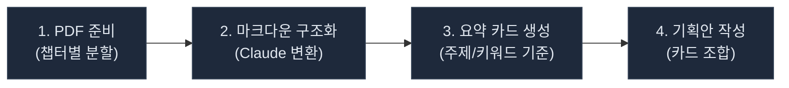
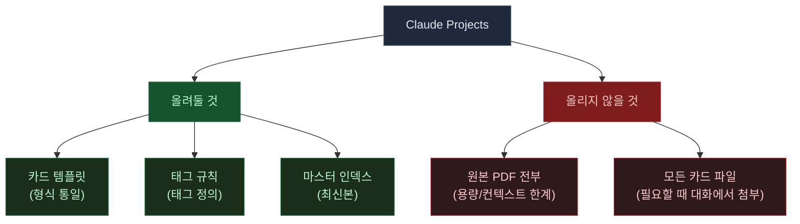
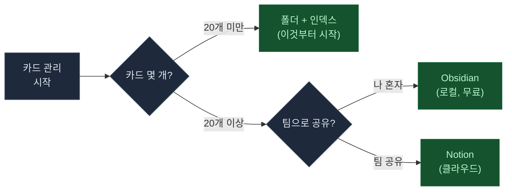
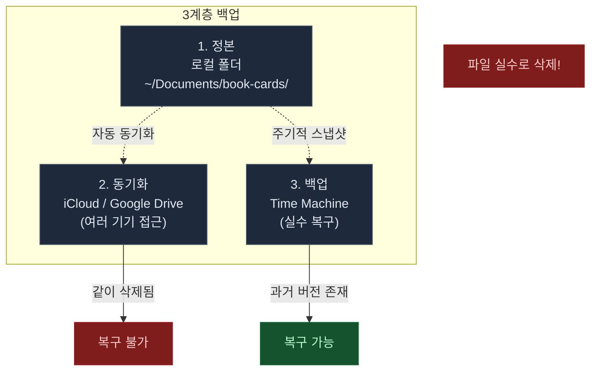

# PDF 구조화 & 요약 카드 관리 가이드

> 업무 서적 PDF를 Claude로 구조화하고, 요약 카드를 만들어 기획안에 활용하는 분들을 위한 실전 관리 가이드

---

## 전체 워크플로우



| 단계 | 작업 | Claude 프롬프트 예시 |
|------|------|---------------------|
| 1 | 원문 PDF 준비 | 큰 PDF는 챕터별로 분할 (시각 자료 많으면 100p 이하 단위 권장) |
| 2 | 마크다운 구조화 | "이 PDF를 마크다운으로 바꿔줘. 각 섹션에 주제 태그도 달아줘" |
| 3 | 요약 카드 생성 | "챕터 3에서 핵심 개념 카드 3장 만들어줘 (아래 템플릿 형식으로)" |
| 4 | 기획안 작성 | "포지셔닝 관련 카드 5개 골라서 마케팅 브리프 만들어줘" |

> **스캔 PDF 주의**: 이미지로 된 PDF(스캔본)는 Claude가 텍스트 추출이 어려울 수 있습니다. 먼저 OCR 처리 후 업로드하세요. (macOS 미리보기 앱이나 Adobe Acrobat으로 가능)

> 2번에서 단순히 챕터 순서대로 나누는 것보다 **주제/키워드 태깅을 같이** 해두면 나중에 책이 쌓였을 때 크로스 검색이 됩니다.

---

## 추천 폴더 구조

```
book-cards/
├── 마케팅불변의법칙/
│   ├── 원본/           ← PDF 원본 보관
│   ├── 마크다운/        ← 챕터별 구조화 (.md)
│   └── 카드/            ← 요약 카드 (.md)
├── 린스타트업/
│   ├── 원본/
│   ├── 마크다운/
│   └── 카드/
├── ...
└── 마스터-인덱스.csv     ← 이게 핵심!
```

### 폴더 위치

| OS | 경로 |
|----|------|
| macOS | `~/Documents/book-cards/` |
| Windows | `C:/Users/내이름/Documents/book-cards/` |

---

## 마스터 인덱스 (핵심)

폴더만 있으면 5권까지는 괜찮은데, 20권 넘어가면 검색이 안 됩니다.

**운영 정본**: Google Sheets (검색/필터 편리) - **백업**: 월 1회 CSV로 내보내 로컬 폴더에 보관

아래 형식으로 한 줄씩 기록하세요.


### 인덱스 양식

| 책 | 저자 | 챕터 | 카드 제목 | 태그 | 한줄 요약 | 파일 경로 | 추가일 |
|---|---|---|---|---|---|---|---|
| 마케팅 불변의 법칙 | 알 리스 | Ch3 | 카테고리 법칙 | #마케팅 #포지셔닝 | 새 카테고리 1등이 기존 시장 2등보다 낫다 | 카드/ch3-카테고리법칙.md | 2026-03-19 |
| 린 스타트업 | 에릭 리스 | Ch5 | MVP 정의 | #MVP #검증 | 최소 기능으로 가설 검증 | 카드/ch5-mvp정의.md | 2026-03-20 |

---

## Claude Projects 활용법

Claude 앱(데스크탑/웹)의 **프로젝트** 기능을 활용하면 효율이 올라갑니다.



> Projects는 Claude에게 대화 공통 맥락을 주는 공간입니다. 파일을 많이 올릴 수는 있지만, 컨텍스트 한도가 있으므로 핵심 참고 자료만 올리는 게 효율적입니다. 장기 보관의 정본은 항상 로컬 폴더 + 백업에 둡니다.

> **저작권/보안 참고**: 유료 서적 PDF나 사내 기밀 문서를 Claude에 업로드할 때는 회사 보안 정책과 저작권 범위를 먼저 확인하세요. 개인 학습 목적의 요약/발췌는 일반적으로 공정 이용에 해당하지만, 전문 복제나 외부 공유는 주의가 필요합니다.

### 카드 템플릿 예시

Projects에 아래를 올려두면 매번 형식을 설명할 필요 없습니다:

```markdown
## [카드 제목]

- **출처**: 책 제목 / 챕터
- **출처 페이지**: p. 45-47
- **핵심 주장**: (1-2문장)
- **사례**: (있으면)
- **태그**: #태그1 #태그2
- **한줄 요약**: (기획안에 바로 쓸 수 있는 한 문장)
```

### 파일명 규칙 (권장)

카드가 쌓이면 파일명이 중요해집니다. 아래 패턴을 추천합니다:

```
ch03-카테고리법칙.md        ← 챕터 번호 + 핵심 키워드
ch05-mvp정의.md
ch12-피벗전략.md
```

---

## 관리 도구 비교

| 방법 | 진입 장벽 | 검색 | 비용 | 추천 대상 |
|------|-----------|------|------|-----------|
| **폴더 + 인덱스** | 낮음 | 인덱스로 검색 | 무료 | 처음 시작할 때 (3-5권) |
| **Obsidian** | 중간 | 태그 + 그래프 뷰 | 무료 | 카드 20개 넘어갈 때 |
| **Notion** | 낮음 | DB 필터/뷰 | 무료/유료 | 비개발자, 팀 공유 |
| **GitHub** | 높음 | 버전 관리 강력 | 무료 | 비추천 (PDF 불편) |



> 처음부터 도구에 투자하지 마세요. 폴더 + 인덱스로 3-5권 해보고, 불편한 점이 생기면 그때 옮겨도 늦지 않습니다. (어차피 마크다운 파일이라 이동이 쉽습니다)

---

## 백업 전략 (중요!)



### 동기화와 백업의 차이

|  | 동기화 (iCloud/Google Drive) | 백업 (Time Machine) |
|---|---|---|
| 실시간 반영 | O | X (주기적) |
| 파일 삭제 시 | 같이 삭제됨 | 과거 버전 복구 가능 |
| 용도 | 여러 기기에서 접근 | 실수 복구 |

> 동기화만 하면 "파일 실수로 지웠는데 구글 드라이브에서도 사라졌어요" 사고가 납니다. 반드시 독립 백업을 하나 더 두세요.

---

## 더 알아보기

- [텐빌더 YouTube](https://youtube.com/@ten-builder) - AI 활용법 영상
- [텐빌더 뉴스레터](https://maily.so/tenbuilder) - 실전 AI 노하우 구독
